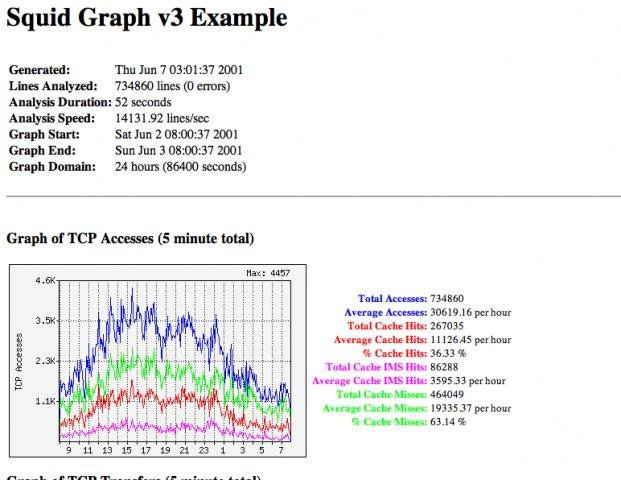
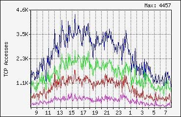
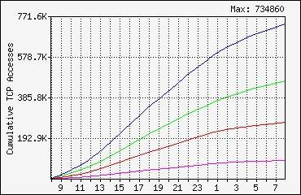

# What is Squid Graph?

Squid Graph is a free, simple, yet powerful Squid v2 logfile analysis
tool that generates reports with graphical representation of the proxy
server's traffic, somewhat like the popular MRTG tool.

## Sample Screenshots

### Full HTML output

### Traffic Graph

### Cumulative Graph

## Supported Platforms

Squid Graph has been tested to run on a Linux machine with Perl 5 on
2.2.x to 2.4.x kernel. It should work with most other similar systems.

A few platforms which Squid Graph have been reported to work with are
FreeBSD, OpenBSD, Sun Solaris and various Linux distributions.

There have also been reports of successfuly running Squid Graph in
Windows using the Win32 port of PERL from ActiveState. Some minor code
modifications may be required.

## Pre-requisites

You will need PERL 5 and GD-1.3.3 installed. See
http://search.cpan.org/dist/GD/ for latest GD version.

GD _must_ be fully installed and working, i.e. all its dependent libs must
also be installed.

## Installing

Squid Graph requires no installation. Simply clone this repository and
move the files to your desired directory, e.g.

    git clone https://github.com/detach8/squid-graph.git
    mv squid-graph/bin/* /usr/local/bin

## Configuring

As of Squid Graph version 3.0, there aren't any more configuration files.
For a list of configuration options, simply run squid-graph without any parameters.

    ./squid-graph

### Changing graph colours

You may change graph colours by editing `squid-graph` and updating the
`$color` variables to your preferred values.

## Running

### Quickstart

To run Squid Graph with the default settings:

    ./squid-graph --output-dir=/var/www/html < /usr/local/squid/access.log

If you do not want any console ouput/logging, you can disable it by using
the `--no-console-log` parameter, e.g.

    ./squid-graph --no-console-log --output-dir=/var/www/html ...

### Advanced

If your cache only logs TCP or does not use UDP at all, you can specify
the `--tcp-only` option for tcp-only output. e.g.

    ./squid-graph --tcp-only --output-dir=/var/www/html ...

Likewise, if you would like to see only UDP (ICP) reports, you can specify
the `--udp-only` option. e.g.

    ./squid-graph --udp-only --output-dir=/var/www/html ...

For more help on running Squid Graph, see the HTML documentation or
the project website.

## Supplementary Tools

### timeconv

`timeconv` is a simple tool to perform time conversion to/from epoch
local time/GMT (UTC), e.g. to convert Epoch to GMT:

    ./timeconv -g 9912334123

### apacheconv

`apacheconv` converts Apache common log format to Squid format, e.g.
to convert Apache logfile to Squid v2 format:

    cat /var/log/apache/access.log | ./apacheconv > converted-access.log

## Running as a web CGI script (Unsupported)

As of Squid Graph v3, running as a CGI is no longer supported. It is
recommended to use a crond job instead.

A sample script [generate.cgi](cgi-bin/generate.cgi) is provided for
running Squid Graph as a real-time CGI, however USE AT YOUR OWN RISK!
The script has not been checked/tested for potential security
vulnerabilities.

## Contributing

Pull requests are welcome. For major changes, please open an issue first to discuss what you would like to change.

## Maintainers

This project has been moved from the original web site at SourceForge
and is no longer under active development.

* Justin Lee (1999-2001) - https://github.com/detach8

## License

This project is licensed under the [GNU General Public License v2](LICENSE).
